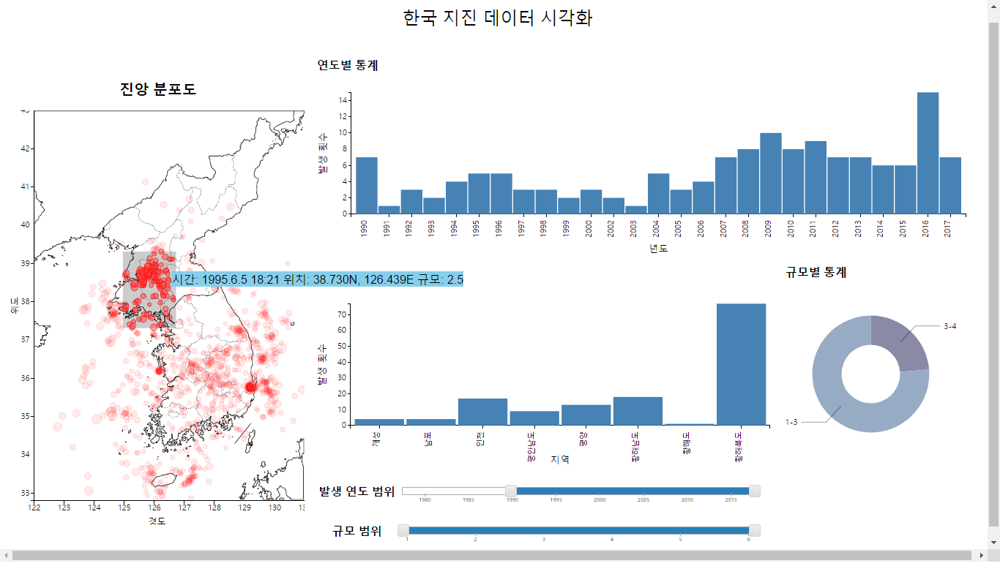

# HCI Final Project Report

### Project Name: EpicenterMap (한국 지진 데이터 시각화)
### Members: 권민혁, 민두기
### Live Demo Page: [https://snuhci2017.github.io/earthquakeMap/](https://snuhci2017.github.io/earthquakeMap/ "라이브 데모 링크")

##프로젝트 개요
 지진 발생을 측정하기 시작한 1978년부터 현재까지 한반도 근처에서 지진은 약 1600건 정도 발생했다. 현재 이 관측 데이터를 기상청에서 일반인들이 열람할 수 있도록 제공한다. 그러나 레코드 단위 또는 모든 데이터를 한꺼번에 지도에 출력(아래 지도 참고)하는 기상청의 공유 방식은 일반인들의 데이터에 대한 접근성을 크게 떨어뜨린다. 이는 일반인들이 국내 지진 발생의 추이 변화와 미래에 발생할 지진에 대한 대비에 대한 안목과 인식을 갖지 못하게 한다. 본 프로젝트에서는 일반인들도 쉽게 사용할 수 있는 지진 데이터 시각화 도구를 구현함으로써 사람들의 데이터에 대한 접근성을 향상시키는데 그 목적을 둔다.  
## Persona 
###Primery Persona
* 어린 자녀들을 키우는 30~50대 부모. 
* 자녀들의 건강하고 안전하게 키우는 것이 삶의 매우 중요한 요소.
* 따라서 정부의 지진 대피 요령 수립 및 내진 설계 강화 지역을 선정 기준 등 재난대책 정책들에 다른 그룹들보다 민감. 
* 정책 평가에 앞서 정적이고 부분적인 정보를 제공하는 뉴스 및 기사 이외에 시간에 따라 누적되는 실시간 데이터를 분석하여 주체적으로 판단하고자 함.
* 지질학 등 지구과학 관련 전공자가 아니며 지진에 대한 고등학교 수준의 지식(진앙, 규모 등의 용어에 대한 이해)을 가지고 있음.

###Secondary Persona
* 중, 고등학교 지구과학 교사.
* 교과서에 실리는 정적 자료(사진, 도표 등)보다 inveractive한 자료를 이용해 학생들의 흥미를 느끼게 하고자 함.

## 문제 인식
기존 기상청의 자료의 가장 큰 문제점은 발생 시각, 위치, 규모 등 3차원 이상의 데이터를 2차원 plot에 출력함으로써 발생 시각에 대한 고려를 제대로 하지 않은 것이다. 이런 시각화 방식은 사용자에게 단순히 위치가 가까운 지진이 서로 연관되어 있다는 인식의 왜곡을 가져다 줄 가능성이 크다 (실제로는 위치가 가까운 두 지진 레코드가 수십 년의 세월을 차이로 발생했음에도 불구하고). 설상가상으로 데이터의 개수가 많아 해당 자료만으로는 분석이 거의 불가능하다. 이를 해결하기 위해서는 각 차원에 따라 데이터를 선택적으로 시각화하여 원하는 정보를 추출할 수 있는 도구가 필요하다.  
 
## UI 디자인
시각화 도구의 전반적인 UI는 아래와 같은 모습이다. UI는 크게 세 부분으로 나뉜다. 먼저, 좌측에 지진 발생 기록을 토대로 진앙의 분포를 나타내는 Scatter plot이 있다. Scatter plot에는 각 지진 레코드가 규모에 비례하는 크기의 지름를 갖는 원 모양으로 출력된다. 기상청에서 제공한 사진에서 규모를 지름과 색상으로 동시에 인코딩하는 방식과 비교해 보면 몇 가지 이점이 있다. 색상에 대한 Legend를 따로 제공할 필요가 없이 사람들의 크기에 대한 일반적인 인식 (점의 크기가 클수록 Feature의 값이 클 것이다). 또 규모를 오직 지름으로 인코딩함으로써 2개 이상의 요소를 사용한 방식보다 사람들의 인식에 왜곡이 생길 가능성이 적다.    
 
그리고 우측에 지진 데이터를 발생 시각, 지역, 규모별 통계를 나타내는 2개의 bar chart와 1개의 pie chart가 위치한다. 발생 시각 - 발생 횟수 관계를 꺾은 선이 아닌 bar chart를 이용한 이유는, 시각화할 데이터를 선택할 수 있는 mouseover 기능을 추가하기 위함이다. Fitts' law에 의하면 target의 width가 클수록 사용자의 performance가 높다. 따라서 사용자가 차트에서 bar를 선택하게 하는 것이 점이나 선분을 선택하는 것보다 더 효율적이라고 판단하였다. 
 
UI의 아래쪽에는 출력할 데이터를 발생 연도와 규모 범위를 기준으로 필터링할 수 있는 2개의 slider가 위치한다. slider를 아래쪽에 배치시킨 이유는 사용자가 slider를 움직이면서 plot과 chart들을 자연스럽게 확인할 수 있도록 하기 위함이다. 

### 주요 기능
####1. 발생 연도 및 규모 별 데이터 필터링
 * 모든 데이터를 한꺼번에 시각화하였을 때 가려지는 정보(두 레코드의 발생 간격 등)를 효과적으로 분석할 수 있도록 필터링 기능을 제공한다. 사용자는 특정 시기 (최근 5년, 특정 연도 등) 및 규모 (예 큰 피해를 줄 수 있는 규모 5.0 이상의 지진 등)에 대해 개별적으로 데이터를 확인할 수 있다. 
####2. 통계 chart 상의 bar 또는 pie에 mouseover시
 * 해당 bar/pie에 대한 데이터를 tooltip으로 보여준다 - 차트에 보여지는 데이터중 일부에 대해 정확한 값을 알 수 있도록 함.
 * 관련 데이터만 scatter plot에 highlight - 이는 UI 사용자가 특정 연도와 지역의 데이터에만 집중하여 분석하기를 원하는 요구를 충족시키기 위한 기능이다.
####3. scatter plot의 brush
 * 이 기능을 사용하면 한반도 지역 중 특정 부분에 대해 발생 추이 등 자세한 분석을 할 수 있다. scatter plot의 일부를 brush하면 영역에 포함되는 레코드만 highlight되며 통계 chart들도 영역 내 포함된 레코드에 대해서 통계를 보여준다. brush 사용 중에 데이터 필터링 기준(기능 1 참고)을 다르게 하면 각 통계는 해당 영역에 새롭게 추가되는 데이터를 통계에 포함시킨다. 

## 인터페이스 사용 시나리오
 1. 사용자는 먼저 지진 발생 추이의 overview를 보고자 하단의 두 slider를 조절하여 모든 연도 및 규모에 대해 데이터를 출력한다. 
 2. scatter plot을 확인할 때, 지진 발생이 집중된 지역, 즉, 여러 개의 진앙이 중첩되어 진하게 보이는 지역들에 주목할 것이다. 그 중 진한 정도가 비슷한 황해도 지역 및 경상 북도 지역을 택하여 두 지역에서의 지진 발생 세부적으로 분석하기로 결정한다.
 3. 먼저 scatter plot에서 황해도 지역을 brush하여 통계 자료를 확인한다. 먼저, 지역별 통계를 통해 황해도 지역에서만 75건의 지진이 집중적으로 발생한 것을 확인한다. 
 4. 그러나 연도별 통계를 보았을 때 연간 발생 건수가 최대 15번 미만인 것을 확인하고, 황해도 지역에서 발생한 지진 추이은 오랜 기간에 걸쳐서 점진적으로 누적된 것임을 파악한다.
 5. 한편, 사용자는 경상북도의 지진 발생 추이를 확인하고자 brush를 이동한다. 그리고 지역별 통계를 통해 약 249건 이상 지진이 발생했음을 확인한다.
 6. 연도별 통계를 확인했을 때 180건 가까운 대다수의 지진이 2016년에 집중되어 있음을 확인한다. 사용자는 이를 토대로 경상도 지역의 지진 발생 추이는 2016년 폭발적으로 증가하였으며 많은 지진들이 짧은 시간 간격을 두고 연쇄적으로 발생했음을 파악할 수 있었다. 나아가 최근 경상도 지역의 지반이 상대적으로 불안정함을 유추할 수 있었다.
 7. 이처럼 사용자는 인터페이스를 이용하여 비슷해 보이는 두 지역의 발생 추이가 시간 축을 고려했을 때 어떤 차이를 보이는지 이해할 수 있었다.

